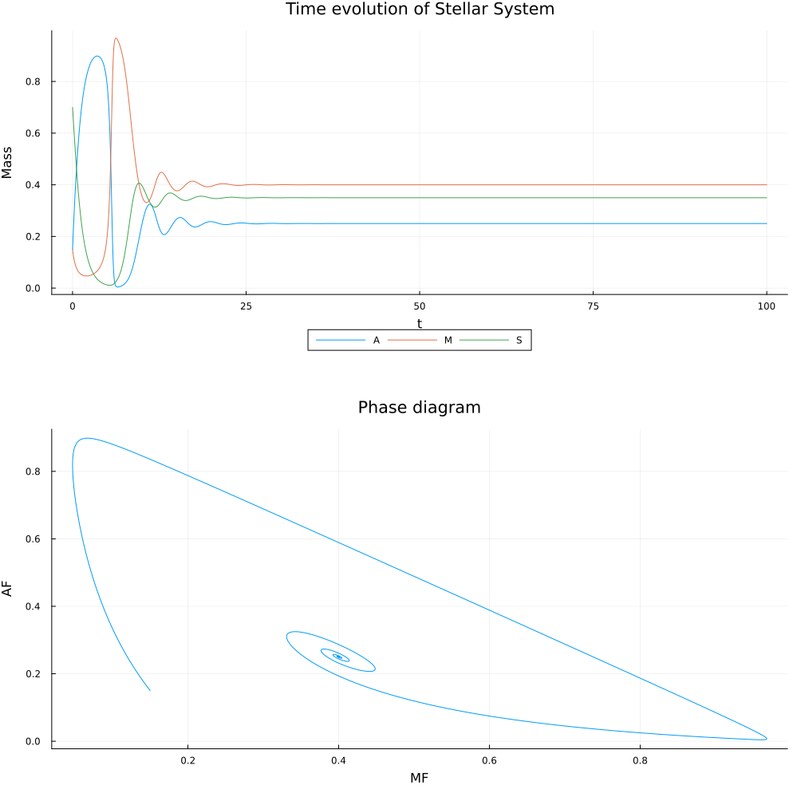

# 28 June 2024

### Star Formation and Julia
- Wrote a julia script to solve the Star Formation model given in "A mathematical model of star formation in the Galaxy - M.A. Sharaf, R. Ghoneim, I.A. Hassan"
- Read a bit about documentation standards in Julia, apparently markdown + docstrings are used, implemented the same
- Wrote two functions to solve the two variants of the Start Formation Model (absolute masses, mass fraction)
- Found a possible error in the paper - The parameters given for the plots in 2a, 2b don't make sense, consequently the plots don't match as well
- The plots in figures 3 and 4 however agree well

### Reading
- Will start reading lawvere Part III - Categories of structured sets from tomorrow
